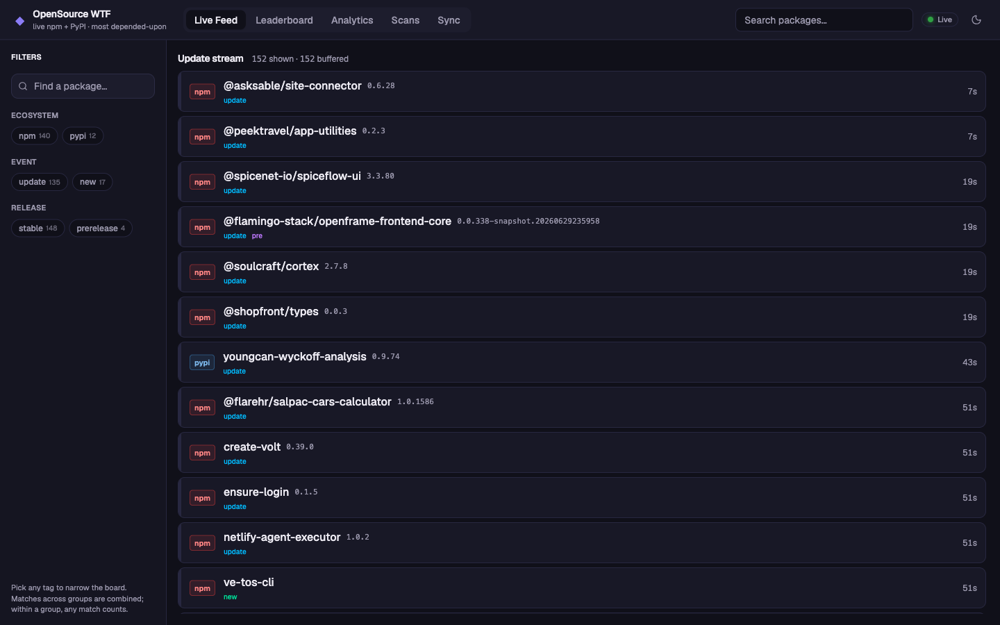
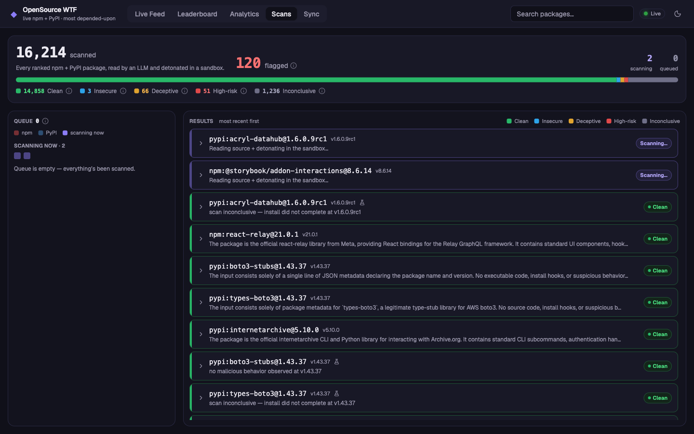
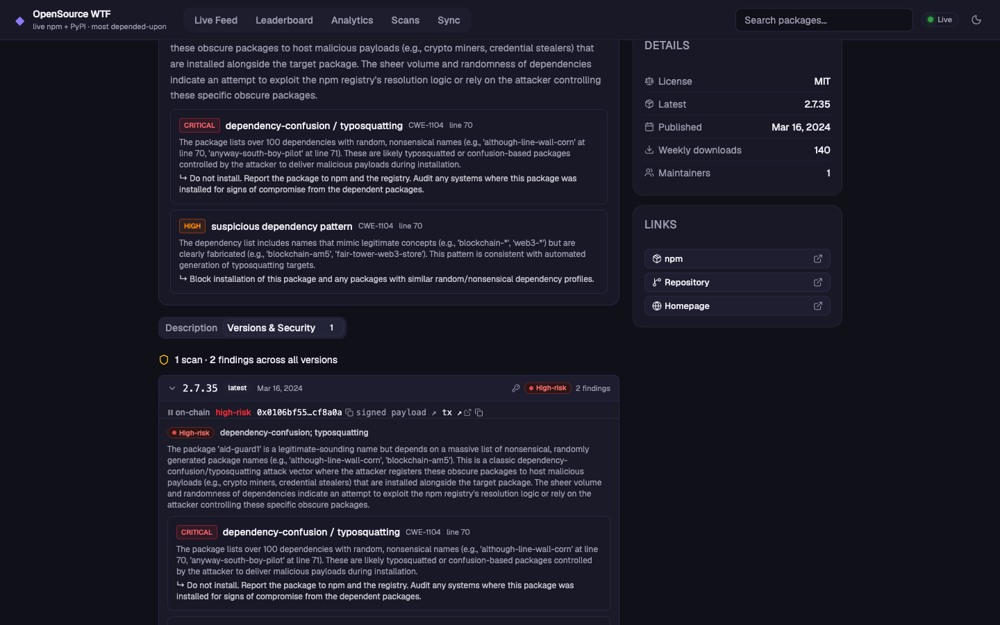
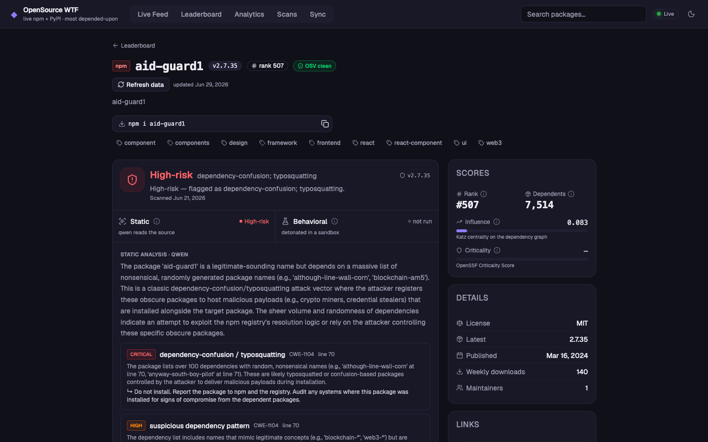

# Catching Malware at Publish Time

*About {{NEW_PER_DAY}} new packages ship to npm and PyPI every day, plus {{UPDATES_PER_DAY}} new versions of existing ones. We read the load-bearing ones with an LLM, run them in a sandbox, and write the verdict to a blockchain.*

[Last time](https://opensource.wtf/blog/launch-the-load-bearing-internet) we ended on a problem. We spend a fortune guarding production, the servers out in the world, and little guarding the machine where the software actually gets built. The supply chain runs right through that machine. Every `npm install` pulls code that you implicitly trust.

The leaderboard tells you which packages the world leans on. It can't tell you if one of them had gone bad. We now added the part that can. It reads new releases, runs them, and flags the ones acting like malware.  Its fast enough to catch a compromised version while its being distributed. The verdicts go on a public blockchain, so they stick around accessible to anyone iwthout being dependent on hosting factors.

## Drinking From a Firehose

Open the **Live Feed** and watch it for a minute.



<small>The live publish stream. The numbers on the right are how long ago each version shipped.</small>

Packages land constantly. On a normal weekday npm and PyPI take in about {{NEW_PER_DAY}} brand-new packages and another {{UPDATES_PER_DAY}} new versions of ones that already exist, close to {{TOTAL_PER_DAY}} publishes a day. Nobody reviews {{TOTAL_PER_DAY}} publishes a day, and for most of them nobody reviews the code at all. A maintainer publishes a version, it's live in seconds, and the first person to install it is the one who finds out if something is wrong.

This isn't a new problem, and we aren't the only ones on it. [SafeDep](https://safedep.io/how-safedep-works) does it too. But few people are doing it for the open-source community, so we are. We haven't caught up to the whole feed yet, so we start with the packages the leaderboard already ranks, the top 10,000 in each ecosystem, and take new releases off the feed as they publish. 

We look at each package three ways. First we run [OSV Scanner](https://github.com/google/osv-scanner), the standard open-source pass against the public advisory databases. Then an LLM reads the source and works out what the code is doing. Then a sandbox installs the package and watches what it reaches for, like the keys and tokens we leave out as bait, and a second model reads back what the sandbox saw. From those three we mark the version High-risk, Deceptive, Insecure, Inconclusive, or Clean.

## AI Adds Coverage To OSV Scanner

OSV Scanner is the first pass, and it's a good one. It checks a package against the public advisory databases, the list of problems someone has already found and written up. It's fast, and it's right about everything on that list. What it can't do is catch something no one has reported yet.

That's where the AI comes in. It reads the source and looks at what the code actually does, not just whether it matches a known signature. So it can catch things that aren't on any list yet, like an install script reaching for keys, a dependency list built to get pulled in by accident, or code obfuscated to hide what it's doing. OSV handles the known cases, and the AI takes the rest.

Take `aid-guard1`. It's the #507 most-depended-upon package on npm, listed as a dependency by 7,514 others, and it gets downloaded 140 times a week. Those two numbers don't belong together, and that gap is the first thing wrong with it. The AI read it and flagged it high-risk. We'll go through its full page later on.

## We catch it while the worm is still spreading

Reading them is half of the job. Doing it in time is the rest. The scanner takes its work off that same publish feed, so most releases get scanned within an hour of going up, not three weeks later in somebody's writeup.



<small>The Scans tab. The bar is every version checked so far, sorted by verdict; the left column is the live queue.</small>

A verdict on a version less than three days old gets flagged, because the dangerous moment for a poisoned release is right after it ships, before anyone has noticed. The npm worms this past year each hit hundreds of packages within a day. On the board that shows up as a batch of brand-new high-risk versions appearing at once, while the worm is still spreading. That's the window where a warning actually helps.

## The verdicts live on a blockchain so they outlast us

A verdict isn't much use if you can't tell whether it's been quietly changed since. So every finished one also gets written to the **TEA blockchain**.



<small>Each verdict is attested on-chain: signed, dated, and linked to a transaction anyone can pull up, sitting apart from our own database.</small>

Our database can go down. The site can be taken offline, pulled by a lawsuit, or shut off when we lose interest. Once a verdict is on the chain, it stays. It's a signed, dated record on a ledger anyone can read, with us or without us. We can't edit it, and we can't quietly retract one to cover a mistake. For a record whose only job is to say a version was malware on a given date, that permanence is the reason to put it on a chain at all. Click any verdict and you can pull up the transaction yourself.

## Everything the scanner found, on one package

Here's `aid-guard1`'s full page, every check the scanner ran in one place.



<small>`aid-guard1`: 7,514 dependents, 140 downloads a week, and a dependency list built to be installed by accident.</small>

At the top of its page is the verdict, **High-risk**, with the reason beside it: dependency-confusion and typosquatting. Under that, the two checks sit side by side, the read and the sandbox run, each with its own result.

Below that is the AI's writeup in plain words. `aid-guard1` has a harmless-looking name and a dependency list full of randomly generated package names. If one of those names matches a package some company uses internally, an installer can pull this public version instead of the private one. The more junk names it lists, the more chances it has to land. The specific finding sits under the writeup, pinned to the line in the manifest, with the names quoted straight from the source.

Off to the side are the numbers the leaderboard runs on, rank and dependents and influence, so you can see how much weight a flagged package was holding up. There's a cross-check against OSV, the public advisory databases, next to our own call. And there's the full version history, each release scored on its own, with the on-chain receipt for this one.

A maintainer can read that page and see exactly what tripped it. Someone about to install the package can see the verdict and stop.

## Come build the next part with us

This is a different way to watch the supply chain. Not a list of malware that already caught someone, but something that reads and runs each package as it ships and leaves a public record of what it found. It's live, it's free like everything else we make, and you can look up anything you depend on.

We're early, and what we want to build next needs open-source developers in it, not just reading the announcement. If that's you, come say hi: the [TEA Discord](#) and [@opensourcewtf](#) on X.

---

## Appendix: reading the record yourself

*For developers. Each verdict is an [EAS](https://attest.org) attestation on the TEA chain. Here is what one holds and how to take it apart.*

The contracts and the signer, all public:

| | |
|---|---|
| Chain | TEA, chainId `6122` |
| RPC | `https://rpc.tea.xyz` |
| Explorer | `https://explorer.tea.xyz` |
| EAS | `0x4a2Dd346f351c3FE890Ff4B47E8124f11fa84a82` |
| Schema UID | `0x5865e88ad6ef941ccb43ae7f7225dbb419b2797a3a946ddd6a193c5492ce5161` |
| Resolver | `0xcb78Fc94aa2fb160d3d89702b0d6078E513e1Bb8` |
| Attester | `0xa25C7910208cB3690E9d1e1F44ff45927A0bBc85` |

Every attestation's `data` is ABI-encoded against one schema:

```
bytes32 subjectKey,
string  environment,
string  package,
string  version,
uint32  runNumber,
string  skill,
uint8   status,
uint8   classification,
bytes32 reportHash
```

| field | type | meaning |
|---|---|---|
| `subjectKey` | bytes32 | `keccak256(abi.encode(environment, package, version))`, the per-version key the resolver dedupes on |
| `environment` | string | ecosystem: `npm` or `pypi` |
| `package` | string | package name |
| `version` | string | the exact version scanned |
| `runNumber` | uint32 | scan run index for this version; the resolver keeps `(attester, subjectKey, runNumber)` unique |
| `skill` | string | which scanner wrote it, e.g. `supply-chain` |
| `status` | uint8 | `0` unknown, `1` completed, `2` errored |
| `classification` | uint8 | `0` unknown, `1` clean, `2` insecure, `3` deceptive, `4` high-risk |
| `reportHash` | bytes32 | `keccak256` of the full findings JSON the site serves for that scan (zero if none) |

The word on the package page is `classification`. The `reportHash` ties the verdict to its detail: refetch the report the API serves and check that `keccak256(utf8(json))` still matches, and you know the findings haven't been swapped under it.

Decode one with [Foundry](https://book.getfoundry.sh)'s `cast`. Start from a UID, which is on the package page next to the verdict:

```bash
EAS=0x4a2Dd346f351c3FE890Ff4B47E8124f11fa84a82
RPC=https://rpc.tea.xyz
UID=0x0106bf5515847ae8518a1b75a2ea54ded5fe567948e2147dcfa2417853cf8a0a   # aid-guard1@2.7.35

# read the attestation; its last field is the ABI-encoded ScanRecord
DATA=$(cast call "$EAS" \
  "getAttestation(bytes32)((bytes32,bytes32,uint64,uint64,uint64,bytes32,address,address,bool,bytes))" \
  "$UID" --rpc-url "$RPC" | tail -1)

# decode that into the schema fields
cast abi-decode \
  "scan()(bytes32,string,string,string,uint32,string,uint8,uint8,bytes32)" "$DATA"
```

which prints the record (this one is real, on-chain now):

```
0x3da85d70…143ccab   subjectKey
npm                  environment
aid-guard1           package
2.7.35               version
0                    runNumber
supply-chain         skill
1                    status          → completed
4                    classification  → high-risk
0xb44398a1…105e2e0   reportHash
```

No UID on hand? Derive it from the package coordinates through the resolver:

```bash
RESOLVER=0xcb78Fc94aa2fb160d3d89702b0d6078E513e1Bb8
ATTESTER=0xa25C7910208cB3690E9d1e1F44ff45927A0bBc85

# subjectKey = keccak256(abi.encode(environment, package, version))
SUBJECT=$(cast keccak "$(cast abi-encode 'f(string,string,string)' npm aid-guard1 2.7.35)")
# → 0x3da85d70…143ccab

cast call "$RESOLVER" "uidFor(address,bytes32,uint32)(bytes32)" \
  "$ATTESTER" "$SUBJECT" 0 --rpc-url "$RPC"
# → 0x0106bf55…cf8a0a
```

No Foundry? The same read is one JSON-RPC call. `getAttestation(bytes32)` has selector `0xa3112a64`, so its calldata is the selector followed by the 32-byte UID:

```bash
curl -s "$RPC" -H 'content-type: application/json' --data \
 '{"jsonrpc":"2.0","id":1,"method":"eth_call","params":[{"to":"'"$EAS"'","data":"0xa3112a64'"${UID#0x}"'"},"latest"]}'
```

The `data` member of the returned struct is the ABI-encoded ScanRecord above. Hand it to any ABI decoder with the tuple `(bytes32,string,string,string,uint32,string,uint8,uint8,bytes32)` and you get the same nine fields, straight off the chain, with nothing of ours in the path.
