# How I got 209.9 tps on Qwen-3.6-35b-a3b.

**David Tai**, OpenSource.WTF

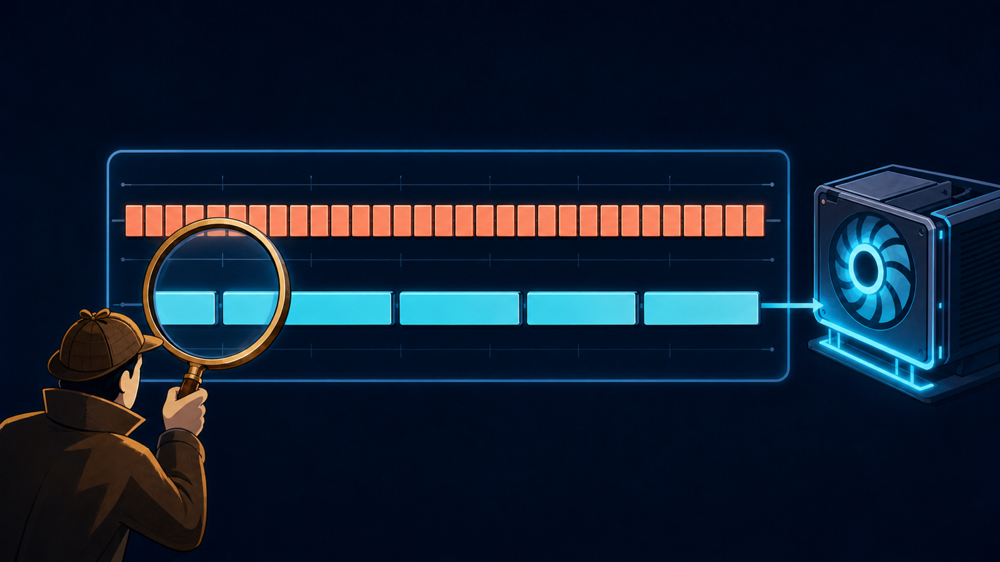

*The investigation began with faster GPU kernels and ended with the command
stream feeding them.*

## 1. Introduction

I have been building fast search systems for longer than I have been working on
language models. My background is in applied bioinformatics, where I worked on
searching chemical libraries for drug discovery. In 2012 I co-published
[SymDex](https://pubs.acs.org/doi/10.1021/ci200606t), an indexing scheme for
chemical-fingerprint searches. A few years later our
[ChemCom](https://pubs.acs.org/doi/10.1021/ci500713s) project introduced the
UnionBit Tree algorithm, which was about 165% faster than its closest competitor
in our tests and roughly 11x faster than Open Babel FastSearch.

That work taught me to look first for work the machine should not be doing.
UnionBit did not win by making every comparison a little faster. It arranged the
search so most comparisons never happened.

These days, at OpenSource.WTF, I apply the same instinct to open-weight language
models on Apple Silicon. The immediate goal behind this project sounded
straightforward: make Qwen3.6-35B-A3B generate 200 tokens per second on a
128 GB M5 Max.

This is a 35-billion-parameter mixture-of-experts model with only about 3 billion
parameters active for each token. It routes each token to 8 of 256 experts plus
one shared expert. The full model fits in memory at 4-bit, and one forward pass
reads about 1.39 GB of weights. At the roughly 500 GB/s this machine sustains
under decode, the weight traffic alone did not explain why the model was slow.
Two hundred tokens per second looked aggressive, but it did not look absurd.

The starting point was 119.5.

MTPLX already knew how to use the model's trained draft head. Turning on
single-draft speculative decoding moved 119.5 to only 129.1 tokens per second. I
was looking for the missing 70.

So I started where I usually start: identify expensive operations, write faster
kernels, prove them correct, then measure the full system again.

Then the kernels started losing strangely. My previous Hy3 campaign had produced
a long run of wins from removing exposed services, so this reversal was
puzzling.

They were not broken kernels. Many were bit-exact. Several were two or three
times faster in isolation. Some removed more than a millisecond of measured GPU
work. Put them back into generation, though, and the model either did not get
faster or became measurably slower.

The question I had been asking was wrong. I was asking how to make the GPU
finish its work faster. I had not established whether the GPU was the part
holding up the cycle.

Once I could measure that, the project changed. Instead of optimizing whatever
looked expensive on the GPU, I started removing graph construction, dispatches,
intermediate tensors, cache bookkeeping, and CPU/GPU round trips. The
byte-identical path reached 188.7 tokens per second. A separately baselined
whole-MoE arithmetic lane reached 199.0, and a realistic coding prompt reached
209.9.

This is how [PR #174](https://github.com/youssofal/MTPLX/pull/174) got there:
six shipped kernel or schedule upgrades, a pile of useful failures, and a
profiler I did not expect to have to build.

## 2. My first attempts

The model uses K1 speculative decoding: its trained MTP head drafts one token,
the target model verifies the committed token and the draft together, and a
rejected draft is repaired with a one-row pass.

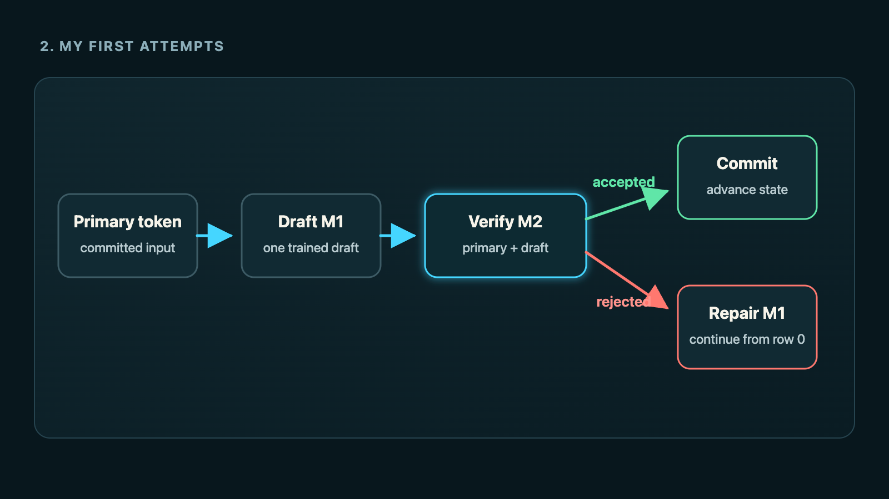

*The target verifies the primary token and one trained draft together. Accepted
drafts commit directly; rejected drafts continue through a one-row repair from
the verified primary-token state.*

Before optimizing that cycle, I had to separate actual performance work from
bugs that made the starting point misleading.

### The bugs were not optimizations

The first bug was in the model contract. `mtp_depth_max` says how many draft
positions an artifact can support. The runtime treated it as the depth it should
use. A3B supports three positions, but its measured best operating point is one.

On the published sweep, changing the operating point from depth 3 to depth 1
moved 107.67 to 138.39 tokens per second: **+28.5% TPS**. That is a large result,
but it is a bug fix, not one of the six shipped performance upgrades.

Four other bug classes mattered during the campaign:

| Bug class | What was wrong | Fix |
|---|---|---|
| Request sizing | The compiled verifier reserved against a fixed assumption rather than the request's required capacity | Make reserve request-aware before installing the route |
| Measurement integrity | The router self-check consumed the generation RNG stream | Save and restore RNG state around installation-time validation |
| Measurement integrity | The combine self-check did the same thing | Make the combine installation RNG-neutral |
| Phase ownership | MTP history could be routed under the wrong constructed phase | Bind history handling to the installed phase |

Those fixes carry no isolated TPS claim. They made the measurements trustworthy
and prevented an invalid route from entering the hot path. That is a different
kind of work from making a correct path faster, and I keep the two categories
separate throughout this post.

### What worked in the first pass

The early optimization attempts were productive. They contained several
successes:

| # | Historical experiment | TPS Δ | Paired result | What it became |
|---:|---|---:|---:|---|
| 1 | [Fixed-M2 GDN post-conv](#experiment-1-fixed-m2-gdn-post-conv) | **+8.157%** | 145.785 -> 157.676 tok/s | Prototype for shipped upgrade #3 |
| 2 | [Row-owned router construction](#experiment-2-row-owned-router-construction) | **+2.290%** | 152.802 -> 156.301 tok/s | Historical evidence for upgrade #5 |
| 3 | [Combine-tail construction](#experiment-3-combine-tail-construction) | **+0.796%** | 156.406 -> 157.650 tok/s | Historical evidence for upgrade #6 |
| 4 | [Captured-primary rejection repair](#experiment-4-captured-primary-rejection-repair) | **+3.236%** | 153.849 -> 158.827 tok/s | Internal part of upgrade #1 |
| 5 | [Early beneficial bundle](#experiment-5-early-beneficial-bundle) | **+7.642%** | 142.179 -> 153.044 tok/s | Stack evidence, not an attribution to one member |

These numbers came from different development windows. They are provenance, not
an additive waterfall, and they are not five extra shipped upgrades.

#### Experiment 1: Fixed-M2 GDN post-conv

The GDN prototype was the first large kernel win. The stock post-convolution
path split normalization, gates, recurrent-state work, and capture across
multiple boundaries. The fixed-M2 kernel kept the exact update order but held
the work together.

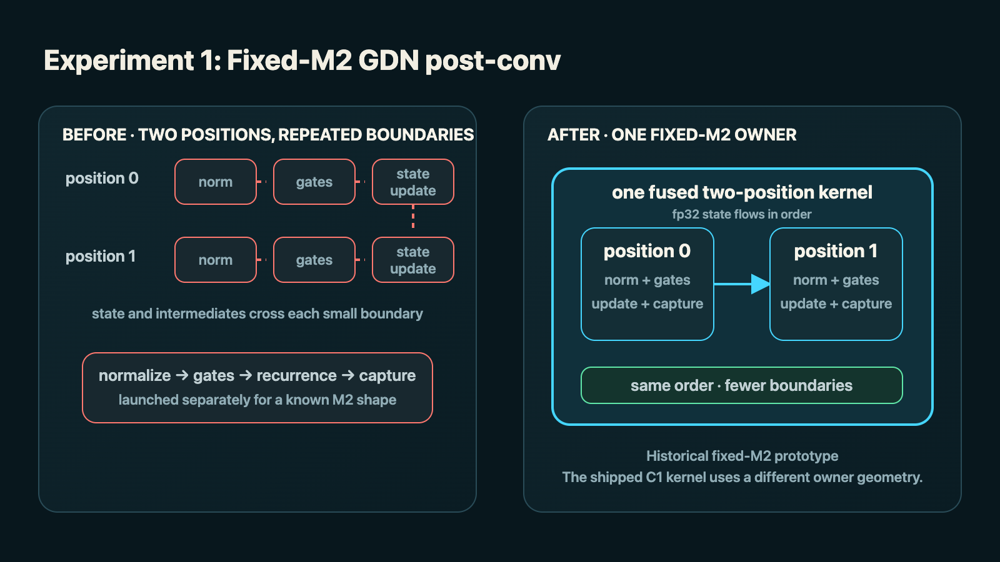

*The fusion keeps normalization, gates, recurrence, capture, and state output
inside one owner without changing their order.*

The transferable idea is not “copy this GDN kernel.” It is to find a serial
recurrent tail whose intermediate state is written only so the next tiny kernel
can read it. Fusion pays when one owner can preserve the same update order and
keep the live state close. It does not pay if the fused kernel reduces
occupancy, changes state ownership, or creates more launches elsewhere.

#### Experiment 2: Row-owned router construction

The row-owned router applied the same ownership test to top-8 selection. At one
or two rows, the arithmetic is tiny; handing each stage to a different kernel
cost more than selecting the experts.

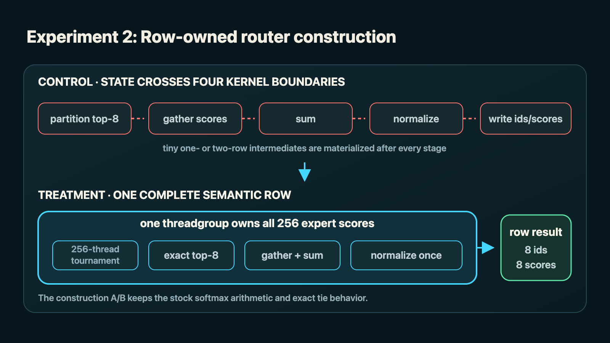

*The owner is the complete semantic row, including exact selection and
normalization—not merely a convenient launch shape.*

One threadgroup owns a complete row, assigns one thread to each of 256 experts,
performs the top-8 tournament, and writes the normalized scores and expert ids.
The important constraint is that the row and expert set fit inside one
threadgroup with exact tie behavior. At larger row counts, or when selection
cannot have one unambiguous owner, this geometry is the wrong one.

> **Row-owner callout — selection:** “Row-owned” means one threadgroup can
> finish the entire semantic row: exact top-8 ids, gathered scores, the required
> sum, and normalization. Merely launching one threadgroup for several rows does
> not establish ownership if the result still crosses another boundary.

#### Experiment 3: Combine-tail construction

The combine tail removed a large temporary tensor from the other end of the
MoE block.

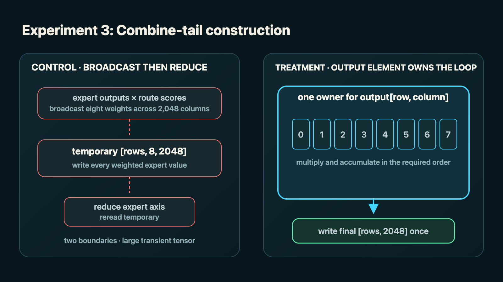

*Output ownership removes the broadcast temporary only while one owner can
preserve the required eight-value accumulation order.*

Each output element is owned by one thread, which performs the eight weighted
accumulations directly. This works because the route count is fixed at eight
and the final output has a natural independent owner. If the reduction order is
part of the exactness contract, that order must be reproduced; “fewer writes”
is not permission to reassociate the math.

#### Experiment 4: Captured-primary rejection repair

The captured-primary repair attacked repeated work outside the kernels. Row 0
of the two-row verify already contains the exact state after the primary token.
The old rejection path threw it away.

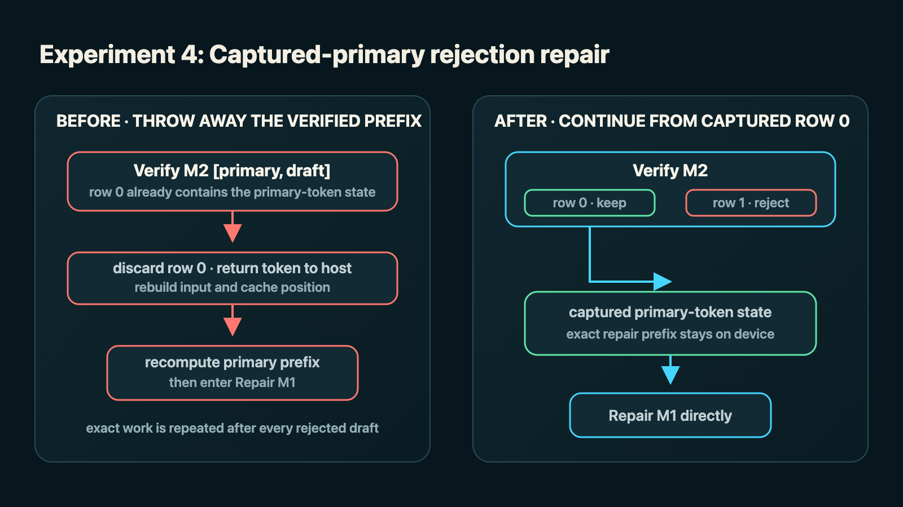

*A rejection continues from the exact prefix already owned by row 0 instead of
reconstructing that state through the host.*

The lesson is broader than speculative decoding: before recomputing after a
branch, check whether the work before the branch already produced the exact
prefix state needed by the recovery path.

#### Experiment 5: Early beneficial bundle

The early bundle combined packed gate/up projections, the row-owned router, the
fused combine tail, fixed-M2 GDN post-conv, and the compiled target forward. It
moved 142.179 to 153.044 tokens per second: **+7.642% TPS**.

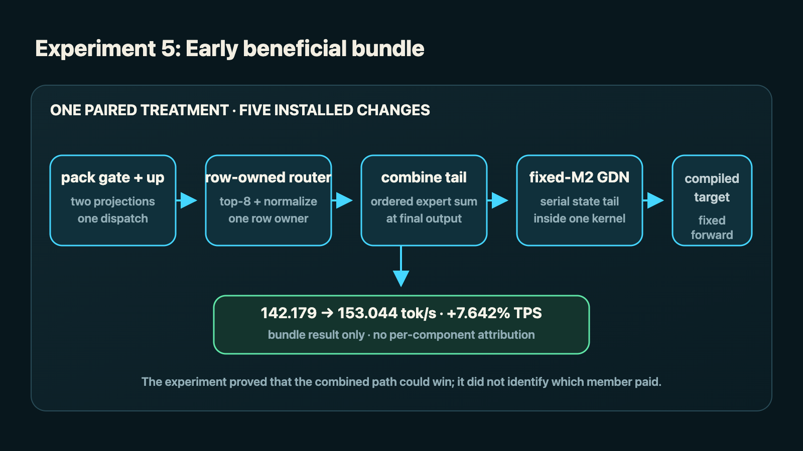

*The experiment measured all five changes as one treatment. It proved that the
combined path won, not how much any one member contributed.*

That A/B proved the stack could win. It did not tell me how much of the gain
belonged to any one branch.

### What did not work

The losing side grew faster:

| # | Experiment | TPS Δ | Paired result |
|---:|---|---:|---:|
| F7 | [Target LM-head top-20 summary](#failure-7-target-lm-head-top-20-summary) | **−5.517%** | 155.313 -> 146.745 tok/s |
| F8 | [Draft LM-head sparse summary](#failure-8-draft-lm-head-sparse-summary) | **−3.756%** | 150.067 -> 144.431 tok/s |
| F3 | [GDN projection pairs](#failure-3-gdn-projection-pairs) | **−2.828%** | 151.002 -> 146.733 tok/s |
| F4 | [Shared-expert SwiGLU fusion](#failure-4-shared-expert-swiglu-fusion) | **−1.205%** | Correct and engaged, slower end to end |
| F5 | [Row-major LM head](#failure-5-row-major-lm-head) | **−0.494%** | 157.020 -> 156.244 tok/s |
| F6 | [GDN RMSNorm/gate fusion](#failure-6-gdn-rmsnormgate-fusion) | **−0.480%** | 156.477 -> 155.725 tok/s |

Some of these results were small. The worrying ones were not. A target LM-head
summary raised acceptance from 0.782 to 0.830 and still lost **−5.517% TPS**.
The model accepted more drafts and generated fewer tokens per second.

At that point I had enough evidence that the bottleneck was not where my kernel
timings said it was.

## 3. The GPU got faster and the model got slower

The cleanest example came from three versions of the same GDN post-convolution
work. All three passed their paired output and acceptance checks, although only
C1 preserved the incumbent arithmetic by construction. All three were faster
than stock on the GPU. The difference was the number of launches they added to
a decode cycle.

| # | Variant | Isolated GPU result | Dispatch change per cycle | TPS Δ |
|---:|---|---:|---:|---:|
| C1 | [Headquarter](#3-gdn-post-conv-fusion) | 3.04x faster | 0 | **+0.82%** |
| C2 | [Recurrence-only](#failure-1-gdn-recurrence-only) | 2.03x faster | +150 | **−2.534%** |
| C3 | [Stock-per-position](#failure-2-gdn-stock-per-position) | 2.10x faster | +150 | **−2.700%** |

C2 and C3 used different GPU geometries and did different amounts of GPU work.
End to end, they lost almost the same amount. The common term was 150 extra
dispatches.

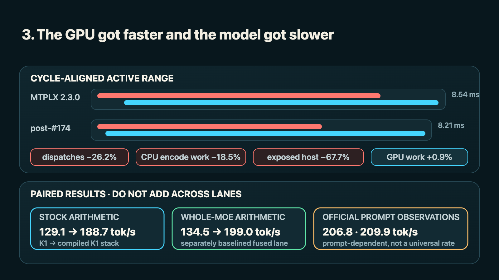

*The successful path shortens the CPU command stream. Its measured GPU work is
slightly longer, but the active range still finishes sooner.*

At one or two decode rows, A3B is a stream of small GPU jobs. The CPU has to
encode each job into a Metal command stream. MLX and Metal overlap some of that
host work with GPU execution, but the queue is shallow and speculative decoding
has a decision point once per cycle. Eventually the host has to learn whether
the draft was accepted.

The cycle is closer to the maximum of the overlapping host-encode and
GPU-execution windows, plus the final decision drain, than it is to a sum of
kernel durations.

That explains how 1.6 ms of isolated GPU savings could disappear while 150
extra launches made the model slower. GPU time pays only where the GPU is the
side the cycle is waiting for. Added host work always has to be encoded.

### The profiler I needed did not exist

MLX could tell me which operations ran. Metal tools could show command buffers
and GPU work. Neither gave me the artifact I needed for this investigation: a
paired, machine-readable decode trace that aligned MLX operations, CPU encode,
command buffers, GPU intervals, waits, and the end-of-cycle drain on one
timeline.

So I stopped writing kernels and built
[mlx-profiler](https://github.com/OpenSourceWTF/mlx-profiler).

This is not a Python wrapper around stock MLX. The information I needed lives
inside MLX's C++ Metal backend, below the point where Python can see it.
`mlx-profiler` is a modified branch of MLX itself.

The code began as a deferred diagnostic change in our local MLX fork during the
A3B encode-replay investigation. That branch later grew capture-replay,
device-feedback, and serving experiments. I did not publish that entire lineage.
For the public profiler, I isolated the original dispatch-census changes,
ported them from their old MLX v0.31.2 base onto current official MLX, and kept
the fork-parent relationship to `ml-explore/mlx`. The port was deliberately
narrow: the dispatch census, the diagnostic asynchronous-task cap, and build
support for reusing a source-matched prebuilt Metal library on machines with
only Apple's Command Line Tools. The later replay and serving code stays out.

The modification sits at the choke points through which Metal work already
passes:

```text
MLX scheduler
    |
    | allocator and task-cap waits -----------------------> wait record
    v
Metal CommandEncoder
    |
    | bind pipeline + set bytes + bind buffers + dispatch -> op record
    |
    | commit command buffer ------------------------------> host encode window
    v
Metal command buffer
    |
    | added completion callback, no added wait ------------> GPU start/end
    v
bounded async queue -> JSONL -> public workbench
```

For every compute dispatch, the modified `CommandEncoder` records the kernel
name, dispatch kind, grid and threadgroup dimensions, `setBytes` calls and byte
count, buffer binds, sequence number, and the command buffer that owns it. This
is the `op` row. The point is not merely to count kernels. It lets me see when a
“single optimization” replaced one launch with four, increased argument
encoding, or changed how MLX grouped work.

At command-buffer commit, the profiler closes the host encode interval and
records the first operation, last operation, and operation count for that
buffer. It then attaches a completion handler to the command buffer MLX was
already going to submit. When Metal completes it, the handler reads
`GPUStartTime` and `GPUEndTime` and emits the `cb` row. Host timestamps and Metal
timestamps use the same clock domain, so the workbench can line up CPU encoding
of command buffer *n+1* with GPU execution of command buffer *n*.

That detail is what makes the profiler useful and also what makes modifying MLX
necessary. A list of kernel durations cannot tell me whether the CPU encoded
the next buffer underneath those kernels or whether the GPU went idle waiting
for it.

The fork also times host stalls at their source. `wait` rows distinguish
allocator-lock contention, garbage collection, new-buffer allocation,
scheduler backpressure, worker-idle time, the asynchronous-task capacity limit,
and an explicit `waitUntilCompleted`. Very short waits stay in aggregate totals
rather than flooding the trace. An optional diagnostic
`MLX_MAX_ACTIVE_TASKS` setting lets me vary MLX's normal asynchronous task cap
while pricing the resulting capacity waits; its upstream default remains
unchanged when the setting is absent.

Finally, `summary` rows report total operations, command buffers, wait counts
and durations, and trace integrity. A synchronization can request a
best-effort live summary. Process teardown writes one terminal `final:true`
summary without forcing an extra GPU drain.

The profiler is designed not to create the bottleneck it is trying to measure.
It does not insert a GPU synchronization to collect timing. Its completion
handler is installed after MLX's runtime handler, and all rows go through a
dedicated asynchronous writer rather than performing filesystem I/O under a
Metal callback, scheduler lock, or allocator lock. The queue is capped at
65,536 rows. If storage cannot keep up, the profiler drops later records and
marks the terminal summary `complete:false` with a nonzero `dropped_rows`
instead of consuming unbounded memory or pretending the trace is complete.

When `MLX_DISPATCH_CENSUS` is not set before the process starts, no output file,
sink state, queue, or writer thread is created. Each hook sees only the cached
disabled flag. When it is set to a regular-file path, all four record types go
into one schema-versioned JSONL:

| Record | What it answers |
|---|---|
| `op` | What was dispatched, with which geometry and argument-binding cost? |
| `cb` | Which operations shared a command buffer, and when did the host encode and GPU execute it? |
| `wait` | Where did the host block, and for how long? |
| `summary` | Is the capture complete, and what are the aggregate counts and waits? |

The workbench turns that JSONL into the view I had been missing: host encoding,
GPU execution, command-buffer boundaries, and waits on one time axis. Host work
that overlaps GPU execution is classified as hidden; host work outside every
measured GPU interval is exposed and can extend the selected wall span.

The public, read-only workbench at
[mlx-profiler.opensource.wtf](https://mlx-profiler.opensource.wtf) calculates
the union of those intervals instead of adding overlapping measurements. It
separates host encode hidden under GPU execution from exposed host time that
extends the wall clock. It also shows command-buffer boundaries, dispatch
density, kernel families, argument-binding activity, and the wait taxonomy for
any selected window.

“Host time” by itself is not enough. Hidden host encode does not extend the
cycle. Exposed host time does. Likewise, summing GPU intervals can overcount
overlap, and dividing GPU work by an arbitrarily long window can manufacture an
idle percentage from a drain tail. The profiler exposes the raw interval
structure so the selected window and the derived aggregates can be checked
rather than trusted from a screenshot.

One older A3B census helped establish the shape of the problem, but it predates
the final instrumentation and is flagged `legacy-unverifiable`. I am not using
its absolute values as a before measurement.

That publication pair now exists. I ran pristine MTPLX 2.3.0 and the
post-[#174](https://github.com/youssofal/MTPLX/pull/174) K1 stack through the
same profiler build, checkpoint, prompt, greedy sampler, seed, 64-token warmup,
and two-token measured request. Whole-MoE fusion was disabled in the after arm
so both sides performed the same arithmetic. Both produced tokens
`[8160, 579]` with the same output hash. Both terminal summaries report
`final:true`, `complete:true`, and `dropped_rows:0`.

The profiler itself has overhead, so these are diagnostic measurements rather
than the official uninstrumented headline:

| Whole measured request | MTPLX 2.3.0 | Post-#174 | Change |
|---|---:|---:|---:|
| Throughput | 158.1 tok/s | 199.3 tok/s | **+26.1% TPS** |
| End-to-end cycle | 12.650 ms | 10.034 ms | **−20.7%** |

I initially made a subtler measurement error while turning those traces into
figures. I selected the last 64 command buffers in both runs. That was not an
equal window: removing dispatches meant 64 post-#174 buffers reached backward
into the previous cycle. Its screenshot contained one cycle's tail, a gap, and
the next cycle, which made the faster result look longer and messier.

The figures below are instead analyzed from the first host-encode endpoint
through the last non-empty GPU endpoint of one active decode burst. The delayed
terminal decision buffer is outside the selected range.

### Before: pristine MTPLX 2.3.0

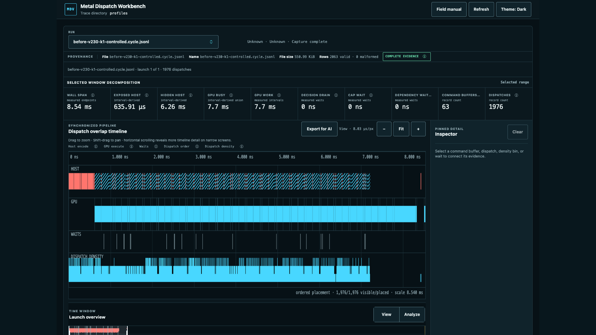

*One active decode burst: 8.54 ms selected wall span, 1,976 dispatches, and
635.91 µs of exposed host encoding.*

### After: the post-#174 exact-arithmetic stack

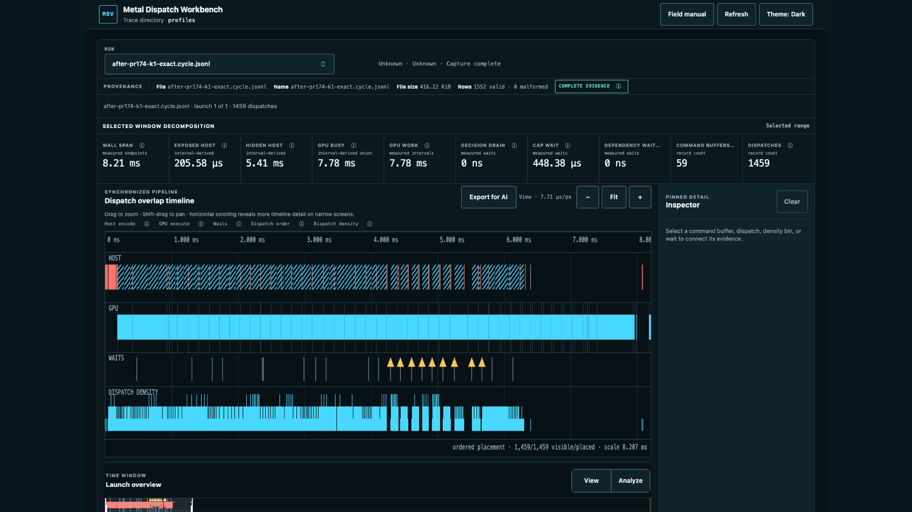

*The equivalent active decode burst: 8.21 ms selected wall span, 1,459
dispatches, and 205.58 µs of exposed host encoding. The yellow markers are
asynchronous task-cap waits that overlap GPU execution, not additional time to
add to the wall span. Compared with the before trace, the CPU encodes 517 fewer
GPU operations and spends 1.275 ms less time building the command stream.*

| Cycle-aligned active range | MTPLX 2.3.0 | Post-#174 | Change |
|---|---:|---:|---:|
| Selected wall span | 8.54 ms | 8.21 ms | **−3.9%** |
| Dispatches | 1,976 | 1,459 | **−26.2%** |
| Command buffers | 63 | 59 | **−6.3%** |
| Total host encode work | 6.895 ms | 5.620 ms | **−18.5%** |
| Exposed host encode | 635.91 µs | 205.58 µs | **−67.7%** |
| Hidden host encode | 6.26 ms | 5.41 ms | **−13.6%** |
| GPU work | 7.70 ms | 7.78 ms | **+0.9%** |
| Task-cap wait | 0 | 448.38 µs | introduced, hidden under GPU work |

Here is what those terms mean:

- **Selected wall span** is elapsed time from the first measured endpoint to
  the last endpoint inside the range shown in the figure. It is the active burst
  in this comparison, not the complete measured request.
- A **dispatch** is one GPU operation encoded by the CPU: usually a kernel
  launch, with its grid, arguments, and buffer bindings. Dispatch count is the
  clearest measure of how much launch administration I removed.
- A **command buffer** groups multiple dispatches for submission to Metal.
  Removing a command buffer avoids a submission boundary, but removing work
  inside the buffers matters too; that is why dispatches fell much more than
  command-buffer count.
- **Total host encode work** sums the CPU intervals spent building those command
  buffers. It is measured encoder work, not overall process CPU utilization.
- **Hidden host encode** overlaps GPU execution. The CPU still performs it, but
  the GPU masks its wall-clock cost.
- **Exposed host encode** happens while no measured GPU interval is active. It
  is the part most likely to lengthen the cycle because the GPU is no longer
  hiding it.
- **GPU work** sums the measured command-buffer execution intervals. It is not a
  utilization percentage and it is not automatically additive with host work,
  because the two overlap.
- A **task-cap wait** means the CPU producer reached MLX's asynchronous
  in-flight-work limit. The yellow waits in the after trace occur while the GPU
  remains active. The paired `cap_wait` and `sched_backpressure` records describe
  the same scheduling episodes and must not be added together.

The CPU-side change is larger than the wall-span change. Encoding work falls
from 6.895 to 5.620 ms: **1.275 ms less CPU work, or −18.5%**. Of that, exposed
host time falls by 430.33 µs, or **−67.7%**. The remainder is work that was
already hidden behind the GPU, but deleting it still gives the CPU more room to
stay ahead of the device.

The CPU gets shorter because it has less to describe. The post-#174 path removes
517 dispatches from this burst, a **−26.2%** reduction, while command buffers
fall by only four. That distinction matters: the win is primarily a shorter
command stream inside the buffers, not merely four fewer submissions.

Meanwhile, measured GPU work rises by roughly 73 µs, or **+0.9%**. The after
arm still finishes the active range 332 µs sooner and the complete profiled
cycle 2.616 ms sooner. That is the trade the profiler exposed. The successful
optimization was not “make every kernel shorter.” It was “make the CPU ask the
GPU to do less administrative work.”

## 4. Stop optimizing one dispatch at a time

The profiler changed the unit of optimization. I could no longer judge a
dispatch only by how long its kernel ran on the GPU. I had to include the Python
work that constructed it, the command encoding around it, the intermediate
buffers it materialized, and any synchronization it forced before the next
dispatch could begin.

From that point on I optimized the CPU and GPU together. On the GPU side, I
collapsed operations only when one owner could preserve the required arithmetic
and carry state across the removed boundaries. On the CPU side, I stopped
rebuilding fixed graphs, rechecking invariant metadata, moving tokens through
the host, and coordinating work the installed route already knew how to run.
Then I arranged the remaining CPU preparation to overlap GPU execution instead
of extending the critical path.

The goal was not the lowest CPU time and the lowest GPU time as two independent
scores. It was one K1 cycle in which the CPU could keep the device fed and both
sides fit inside the same sub-9 ms wall-clock envelope. A kernel could be
slightly slower in isolation and still be the right trade if it removed enough
dispatch and host work to shorten that cycle.

[PR #174](https://github.com/youssofal/MTPLX/pull/174) ships six top-level
kernel or schedule upgrades. The first two are the large architectural changes.
On-device draft construction, captured-primary repair, and tiled Stage 1 are
parts of these upgrades, not upgrades seven through nine.

| # | Shipped upgrade | Measured treatment |
|---:|---|---|
| 1 | [Compile the K1 route, not just the model](#1-compile-the-k1-route-not-just-the-model) | **+46.2% TPS** for the full final-ladder step; on-device draft **+1.70% TPS** isolated |
| 2 | [Collapse the whole MoE block](#2-collapse-the-whole-moe-block) | **+5.5% TPS** in the final ladder; tiled Stage 1 **+3.47% TPS** historically |
| 3 | [GDN post-conv fusion](#3-gdn-post-conv-fusion) | **+0.82% TPS** for the shipped C1 variant |
| 4 | [Pack gate and up projections once](#4-pack-gate-and-up-projections-once) | Supporting kernel; no clean isolated delta |
| 5 | [Give each router row one owner](#5-give-each-router-row-one-owner) | Historical construction A/B **+2.290% TPS**; no clean isolated final-stack delta |
| 6 | [Fuse the weighted combine tail](#6-fuse-the-weighted-combine-tail) | Historical construction A/B **+0.796% TPS**; no clean isolated final-stack delta |

### 1. Compile the K1 route, not just the model

The old speculative loop rebuilt too much of the schedule on every cycle.

The replacement proves the fixed facts once, when the request route is
installed:

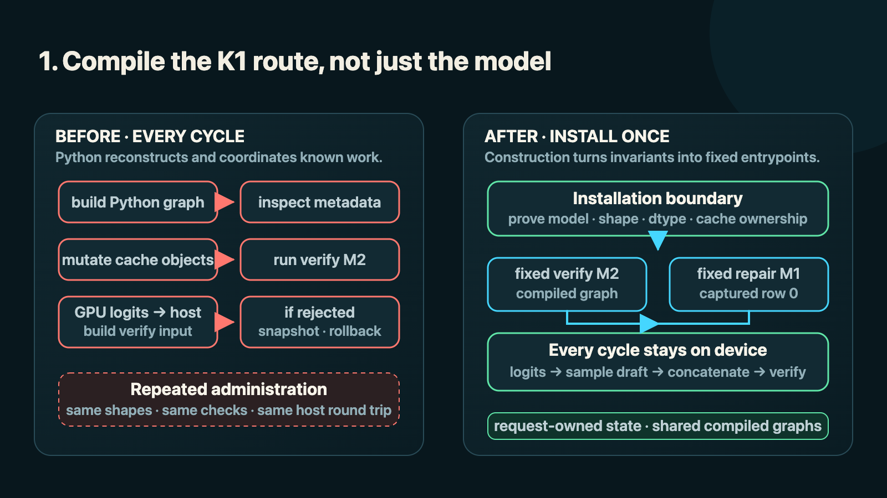

*Compilation pays here because shapes, arithmetic, cache ownership, and the
repair prefix are proved once rather than rediscovered every cycle.*

The two compiled graphs are shared across requests, while the state slots belong
to the request. The hot path does not rescan invariant metadata, mutate Python
cache ownership, try the custom route and fall back, or count its own
engagement. If the construction-time checks fail, the route is never installed.

That distinction is important for applying this elsewhere. “Compile the loop”
does not mean put a compiler around dynamic Python and hope. It means identify
which shapes, state owners, cache positions, and arithmetic choices are
invariant; encode those invariants in fixed entrypoints; validate them once;
then enter the route directly.

The on-device draft removes one of the two CPU/GPU round trips. Previously,
logits returned a token integer to the host so Python could build the verify
input. The installed route samples and concatenates on device, then enters the
GPU verifier directly.

That component measured **+1.70% TPS** by itself, 161.64 to 164.39 tokens per
second. The full route step, including the compiled schedule and the already
landed fused work, moved 129.1 to 188.7 tokens per second: **+46.2% TPS**, with
the same output hash as the autoregressive reference.

This was the large win. It did not make the model's arithmetic cheaper. It
stopped reconstructing and coordinating the same arithmetic 100-plus times per
second.

### 2. Collapse the whole MoE block

The stock MoE path expressed a small one- or two-row computation as twelve
source-level device boundaries. The fused path gives those operations three
explicit owners.

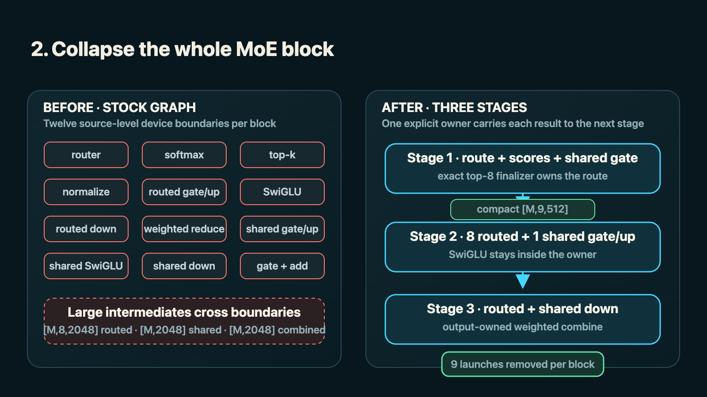

*The fused lane removes nine launches per block and carries only the compact
activation between stages; it keeps its own arithmetic baseline because the
final combine changes accumulation order.*

This removes nine launches per block across 40 target blocks plus the draft
block. It also avoids materializing the large routed `[M,8,2048]`, shared
`[M,2048]`, and combined `[M,2048]` intermediates. Only the compact
`[M,9,512]` activation crosses from Stage 2 to Stage 3.

The first two-row Stage 1 grouped the rows but did not make one weight read serve
both of them. It gained **+1.70% TPS**, but cycle time became 0.67% slower, so it
was rejected. The working version tiled the expert axis:

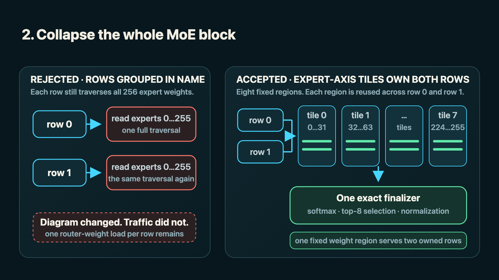

*The accepted geometry earns its name by sharing each packed router-weight
region across both rows, then finalizing the route exactly once.*

Now each tile loads one fixed router-weight region and uses it for both owned
rows. The finalizer performs softmax, exact top-8 selection, and normalization.
That change measured **+3.47% TPS**, with cycle time 2.84% faster, in its
historical paired window.

The portable test is stricter than “batch two rows.” A row-collapse kernel must
prove that a fixed weight and its quantization metadata are actually shared
across the owned rows. If the weight is still loaded once per row inside the
loop, the diagram changed and the memory traffic did not.

> **Row-owner callout — reuse:** one owner is useful only when it changes the
> traffic. In the accepted M2 geometry, each expert-axis tile loads a fixed
> weight region once and applies it to both rows before one exact finalizer. The
> rejected version grouped rows in its launch geometry but retained one complete
> weight traversal per row.

Whole-MoE fusion adds **+5.5% TPS** in the final ladder, from 188.7 to 199.0.
It has a separate arithmetic baseline because Stage 3 changes floating-point
accumulation order. The fused lane's correct comparison is 134.5 to 199.0, not
119.5 to 199.0.

On the final-tree window, the fused K1 cycle averaged 8.78 ms. That was the point
where CPU-side preparation and GPU execution had been pushed into the same
sub-9 ms envelope instead of appearing as a long chain of individually
optimized kernels.

## 5. The other four shipped upgrades

The remaining four changes are smaller, but they complete the same argument:
remove a boundary only when ownership and arithmetic make the removal sound.

### 3. GDN post-conv fusion

Qwen3.6-35B-A3B has 30 Gated Delta Net layers. After each layer's causal
convolution, the model normalizes q and k, computes decay and write gates,
updates a per-head fp32 recurrent state, captures the state, and produces the
output.

The shipped C1 kernel gives one threadgroup ownership of a
value-head/state-quarter tile. Shared normalization and gates are computed once
into threadgroup memory, while each SIMD group keeps its slice of recurrent
state in registers across the position loop.

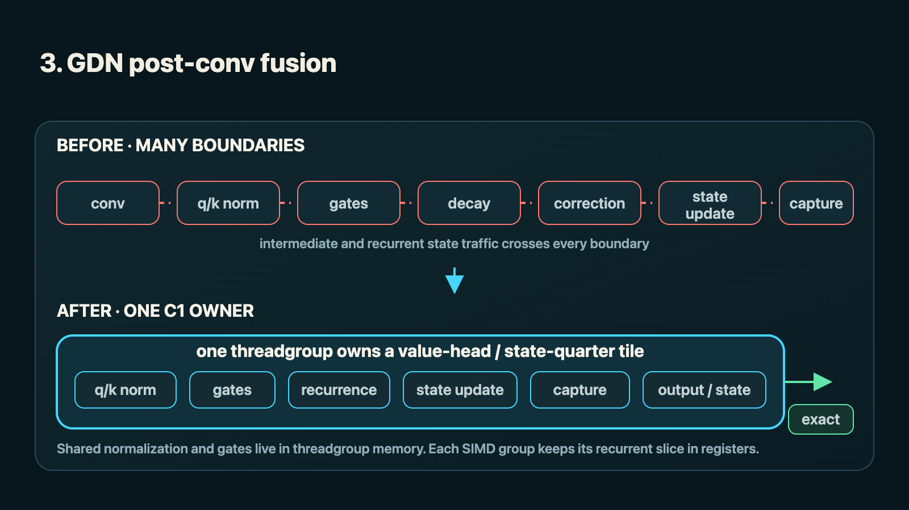

*The shipped C1 owner removes intermediate traffic without reassociating the
serial recurrence.*

The exact shipped variant measured 163.0 to 164.4 tokens per second:
**+0.82% TPS**. The earlier fixed-M2 prototype's **+8.157% TPS** came from a
different historical stack and geometry; it is useful evidence that the
mechanism mattered, not the current kernel's contribution.

This fusion is specific to a short, serial recurrent tail. It is a poor fit when
the state does not stay owned by one group, when the position loop is large
enough to crush occupancy, or when preserving update and capture order would
require extra synchronization.

### 4. Pack gate and up projections once

The routed and shared experts each apply a gate projection and an up projection
to the same input. Stock MLX launches them separately.

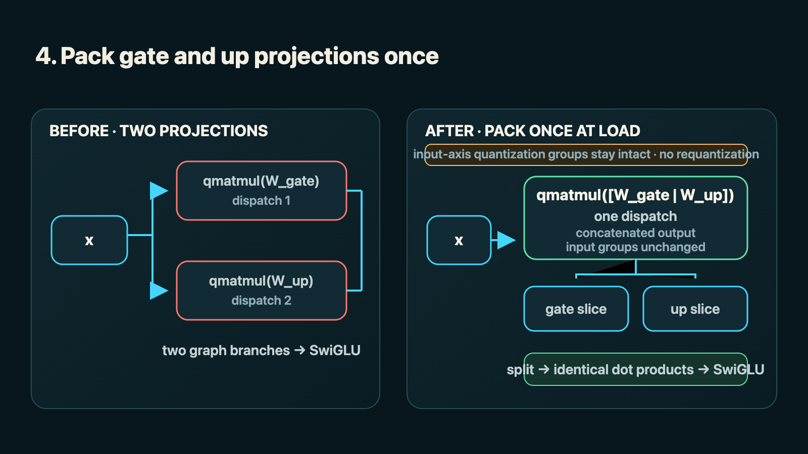

*The output-axis pack is installed once and leaves every input-axis
quantization group intact.*

Affine quantization groups run along the input axis. The weights are
concatenated along the output axis, so no quantization group is crossed, no
weight is requantized, and every output still comes from the same dot product.
The packing is done once when the route is constructed. Bias, dtype, width,
expert-count, or quantization mismatches prevent the packed route from being
installed.

There is no defensible isolated TPS percentage for this supporting kernel. It
was measured in the early **+7.642% TPS** bundle with the row-owned router,
combine tail, compiled route, and post-conv work. The transferable part is the
layout test: packing is safe only when the concat axis is outside the
quantization groups and both projections share the same input and execution
contract.

### 5. Give each router row one owner

The row-owned router described in the first-attempts section ships as a
supporting kernel. It turns four post-softmax stages into one row-owned stage:

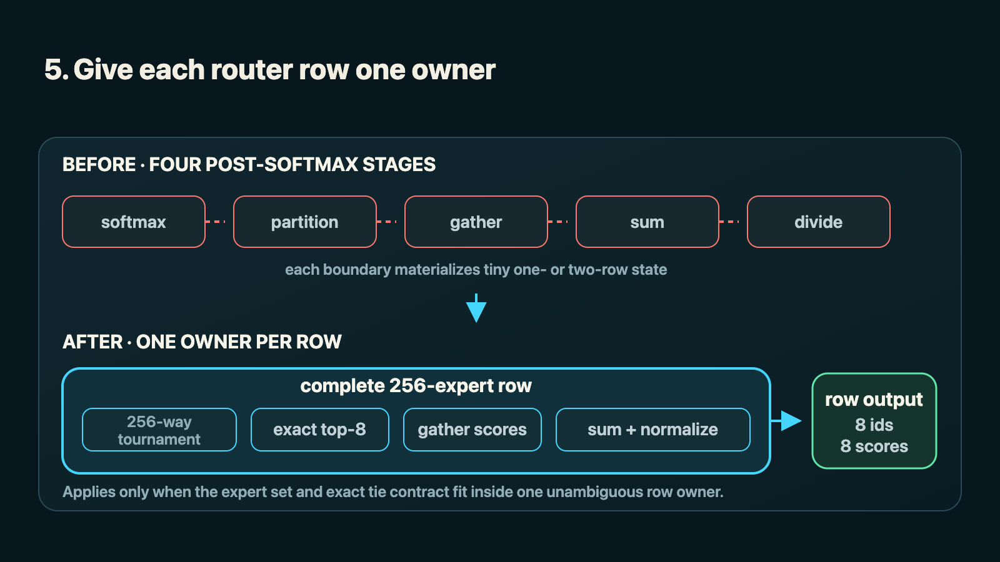

*The historical construction A/B measured the mechanism, but the final stack
does not assign it a clean isolated contribution.*

The historical construction A/B measured **+2.290% TPS**, but the final PR stack
does not have a clean isolated contribution for this kernel. It is already
enabled in the baselines used to measure the three main upgrades.

What transfers is ownership, not the launch dimensions. For another model,
remeasure the expert count, row count, tie rules, normalization precision, and
threadgroup capacity. If a row cannot be completed independently, the same
kernel shape will not preserve the route.

> **Row-owner callout — applicability:** the owner must fit the model's real
> row width, exact tie contract, normalization precision, and available
> threadgroup resources. Hy3 and A3B both benefited from explicit row ownership,
> but they required different tiling and phase routes. The topology is not the
> optimization.

### 6. Fuse the weighted combine tail

The combine-tail kernel gives one output column ownership of the full
eight-expert weighted reduction:

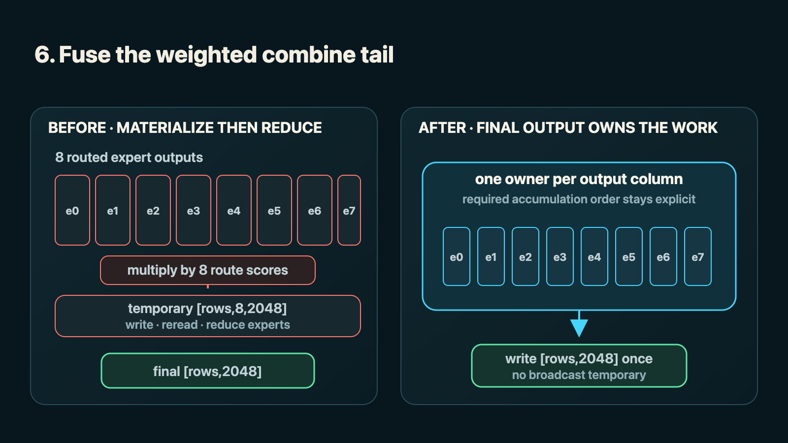

*This supporting kernel removes a temporary and a launch; its isolated windows
were too mixed for a clean current TPS claim.*

The historical construction A/B measured **+0.796% TPS** with exact output.
Later isolated windows ranged from **−7.4% TPS** to **+0.15% TPS**, so I do not
assign it a clean current contribution. It ships as a supporting part of the
stack, where removing the temporary and one launch is still structurally useful.

This is a good example of why a diagram is not enough. The rewrite applies when
the route count is small and fixed, output columns have independent ownership,
and the required accumulation order fits in one owner. With a large or dynamic
route count, the serial accumulation can erase the dispatch saving.

## 6. What we accomplished

The final result has two arithmetic lanes. Mixing them would produce a more
impressive number and a less honest comparison.

| Configuration | Arithmetic lane | tok/s | TPS Δ |
|---|---|---:|---:|
| Autoregressive baseline | Stock | 119.5 | — |
| K1 speculative decode | Stock | 129.1 | **+8.0%** |
| Compiled K1 stack | Stock | 188.7 | **+46.2%** vs previous |
| Autoregressive baseline | Whole-MoE fused | 134.5 | — |
| Full K1 stack | Whole-MoE fused | 199.0 | **+48.0%** vs fused AR |

The byte-identical result is 119.5 to 188.7 tokens per second: **+57.9% TPS**,
or 1.58x, with the same output hash.

The whole-MoE result is 134.5 to 199.0: **+48.0% TPS**, or 1.48x, inside its own
arithmetic lane. The additional final-ladder step from 188.7 to 199.0 is
**+5.5% TPS**, but it crosses output hashes and is disclosed as such.

The fused reduction preserves exact router ids and scores but changes the last
bits of some activations by changing accumulation order. Two full quality runs
put HumanEval at 154/164 versus 152/164 for the stock-arithmetic control. MBPP
was 788 and 790/974 versus 792/974. That is small relative to the variation we
observed between the two candidate runs, but both MBPP runs moved in the same
direction. I treat the quality result as bounded, not as proof of zero
difference.

Finally, our official uninstrumented benchmarking with randomly generated
coding prompts produced observations of **206.8** and **209.9 tokens per
second**. The maximum came from a 133-token prompt at 0.86 acceptance. A
separate 143-token prompt produced adjacent windows of 206.2 and 206.8 at 0.822
acceptance. These are prompt observations, not a universal model rate: a more
predictable prompt produces more accepted drafts and higher throughput.

No additional quantization was required. The other reusable output is the
profiler, now available as both
[source](https://github.com/OpenSourceWTF/mlx-profiler) and a
[public workbench](https://mlx-profiler.opensource.wtf).

## Addendum: Why I keep coming back to row ownership

I use “row-owned” throughout this post, but the useful idea is more precise
than a kernel name. A good ownership rewrite gives one execution unit
responsibility for one complete semantic result, reuses the data that unit
owns, preserves the required arithmetic and ordering, and installs the route
only for shapes where those statements are true.

That produces four questions I now put beside every row-owned candidate:

| Ownership question | What must be true |
|---|---|
| What is owned? | A complete router row, recurrent-state tile, output column, slot generation, or other result with a clear finish line |
| What is reused? | A fixed weight region, metadata, live state, or partial result serves all work under that owner rather than being reread or rematerialized |
| What is preserved? | Exact ids, tie rules, normalization precision, update order, and any required accumulation order |
| Where does it stop? | The installed shape and phase route ends before the owner becomes ambiguous or too small to use the hardware well |

> **Row-owner callout — the test:** fewer threadgroups are not automatically
> better. The owner has to eliminate coordination or reuse data. A single
> undersized threadgroup that rereads the same weights can be slower than the
> generic kernel even though its diagram looks cleaner.

Hy3 was the first place this became a repeatable technique for me. Its
192-expert router needed different geometry for draft and verify rows. The
row-owned Metal path gave each output row one explicit owner and tiled weights
in consumption order; the surrounding router chain moved the 2-bit resident
lane from 6.66 to 8.39 tokens per second with bitwise-identical output. The
hardware boundary mattered just as much as the success: the row-owned path won
on M2-class Apple chips and newer but lost on M1, where one threadgroup could
not saturate memory bandwidth. The installed route therefore kept stock M1
execution instead of forcing the attractive topology everywhere.

A3B reused the ownership test, not the Hy3 kernel. Its 256-expert route, hidden
width, quantization, and one- versus two-row verify shapes required new tiling.
The exact one-row finalizer measured **+2.290% TPS** in its historical
construction A/B. The first two-row whole-MoE attempt then demonstrated the
failure mode: it grouped two rows but still traversed the router weights once
per row. Only the expert-axis version made one packed-weight read serve both
owned rows, and that version measured **+3.47% TPS** with cycle time
**−2.84%**.

On GLM-5.2, the same discipline moved from arithmetic rows to streamed expert
ownership. A verification call can route several rows whose expert union
exceeds the transient bank, so the runtime has to make slot generations, pins,
miss waves, and release boundaries explicit. A depth-four test with 32
transient slots exposed a lock carried across a wave boundary; the same thread
then tried to acquire it again and generation appeared to hang. Releasing
ownership at the final wave of the current layer restored exact token parity,
although that depth remained slower in that configuration. I do not count that
as a throughput win. I count it as supporting evidence for the mechanic:
performance work becomes tractable only after every row, slot, and state
transition has an owner with a provable lifetime.

The portable lesson is not “use one threadgroup per row.” It is: find the
smallest semantic unit that can own the whole result, prove what data it can
reuse, and stop before the ownership contract stops matching the machine.

## 7. Conclusion

I began this project looking for expensive GPU kernels. That was not an
unreasonable place to start, but I stayed there after the end-to-end results had
stopped supporting it.

The breakthrough was not a cleverer kernel. It was learning to distinguish GPU
work from the work required to describe, submit, and synchronize that GPU work.
Once the decoder was running at one or two rows, launch structure and host
coordination mattered more than many of the FLOPs I was removing.

None of these six upgrades is portable as code. They depend on A3B's exact
shapes, quantization groups, ownership, tiling, state layout, and decode
contract. The method is portable:

1. Measure the whole cycle before optimizing a component.
2. Keep bug fixes separate from performance wins.
3. Check whether the CPU or GPU is extending each part of the timeline.
4. Remove repeated work and boundaries before making the work inside them
   faster.
5. Prove invariant shapes and ownership once, then install a direct route.
6. Rebuild the geometry for the real model rather than transplanting a kernel
   by name.

The line I would put above the benchmark harness now is simpler: before making a
kernel faster, find out whether the application is waiting for it.

## Appendix: Hall of failures

These ideas failed on A3B at one- and two-row decode. Several may be useful at
larger batch sizes, during prefill, on a dense model, or on a checkpoint with a
better second draft head.

### Faster GPU work that lost end to end

| # | Experiment | TPS Δ | Where it may still work |
|---:|---|---:|---|
| F1 | [GDN recurrence-only](#failure-1-gdn-recurrence-only) | **−2.534%** | A GPU-bound regime where launch cost is hidden |
| F2 | [GDN stock-per-position](#failure-2-gdn-stock-per-position) | **−2.700%** | Larger batches with enough GPU work per launch |
| F3 | [GDN projection pairs](#failure-3-gdn-projection-pairs) | **−2.828%** | Prefill or a wider decode batch |
| F4 | [Shared-expert SwiGLU fusion](#failure-4-shared-expert-swiglu-fusion) | **−1.205%** | A model with a larger shared expert |
| F5 | [Row-major LM head](#failure-5-row-major-lm-head) | **−0.494%** | Larger row counts |
| F6 | [GDN RMSNorm/gate fusion](#failure-6-gdn-rmsnormgate-fusion) | **−0.480%** | A longer position loop or GPU-bound batch |

#### Failure 1: GDN recurrence-only

The recurrence-only kernel was 2.03x faster than stock in isolation but added
150 dispatches per cycle. End-to-end throughput fell **−2.534% TPS**. It could
still fit a wider, GPU-bound workload where those launches are hidden behind
enough device work.

#### Failure 2: GDN stock-per-position

The stock-per-position geometry was 2.10x faster on the GPU and added the same
150 launches. It lost **−2.700% TPS**, almost the same result as recurrence-only
despite doing different GPU work. That near-match was the clue that dispatch
count, rather than isolated kernel time, controlled the outcome.

#### Failure 3: GDN projection pairs

Pairing the GDN projections reduced local GPU work but lengthened the coupled
decode cycle, moving 151.002 to 146.733 tokens per second:
**−2.828% TPS**. More rows or a prefill workload could make the saved device work
large enough to repay the added structure.

#### Failure 4: Shared-expert SwiGLU fusion

This path was correct and fully engaged, but the component saving was smaller
than the overhead around it. It lost **−1.205% TPS**. A model with a larger
shared expert could shift that balance.

#### Failure 5: Row-major LM head

The row-major LM head preserved the output hash but changed the kernel geometry
without removing the boundary that was extending the cycle. It moved 157.020 to
156.244 tokens per second: **−0.494% TPS**. The geometry is more plausible when
one launch owns more rows.

#### Failure 6: GDN RMSNorm/gate fusion

Fusing RMSNorm and the GDN gates was correct but too small for this cycle,
moving 156.477 to 155.725 tokens per second: **−0.480% TPS**. A longer position
loop or larger batch would give the fused work more GPU cost to remove.

### More accepted drafts that still generated more slowly

| # | Experiment | TPS Δ | What happened |
|---:|---|---:|---|
| F7 | [Target LM-head top-20 summary](#failure-7-target-lm-head-top-20-summary) | **−5.517%** | Acceptance rose, but the added summary work cost more than the accepted drafts returned |
| F8 | [Draft LM-head sparse summary](#failure-8-draft-lm-head-sparse-summary) | **−3.756%** | The summary was correct, but the draft phase became slower |
| F9 | [First whole-MoE row-owned M2 cut](#failure-9-first-whole-moe-row-owned-m2-cut) | **+1.70%** | TPS rose while cycle time regressed, so the experiment failed promotion |

#### Failure 7: Target LM-head top-20 summary

The target-side summary raised acceptance from 0.782 to 0.830 and still moved
155.313 to 146.745 tokens per second: **−5.517% TPS**. The summary work cost more
than the extra accepted drafts returned.

#### Failure 8: Draft LM-head sparse summary

The draft-side summary passed its correctness check, but draft time rose from
1.384 to 1.828 ms. End-to-end throughput moved 150.067 to 144.431 tokens per
second: **−3.756% TPS**.

#### Failure 9: First whole-MoE row-owned M2 cut

The first M2 cut reported **+1.70% TPS**, but cycle time became 0.67% slower.
The candidate had changed the token stream and acceptance, so the positive TPS
number did not describe a faster implementation and the experiment was
rejected.

Failure 9 is why TPS alone was not the promotion gate for
arithmetic-changing experiments. A positive throughput percentage can still
describe a slower cycle if the candidate changes acceptance.

### Optimizations aimed at the wrong regime

| # | Experiment | TPS Δ | Possible useful regime |
|---:|---|---:|---|
| F10 | [Depth-2 speculation](#failure-10-depth-2-speculation) | **−40.7%** short prompt; **−37.8%** long code | A checkpoint with an independently trained second draft head |
| F11 | [Whole-MoE weight-load vectorization](#failure-11-whole-moe-weight-load-vectorization) | **−0.717% mean** | A different memory layout or wider batch |

#### Failure 10: Depth-2 speculation

Depth 2 was byte-identical, so this was not a correctness failure. The short
prompt lost **−40.7% TPS** and long code lost **−37.8% TPS** because the
three-row cycle cost about 1.34x the two-row cycle while second-position
acceptance could not repay the extra work. It was a checkpoint-economics
failure. The generic three-row kernels may still be useful for a model whose
second draft position was actually trained.

#### Failure 11: Whole-MoE weight-load vectorization

Three paired results landed at −0.922%, −1.604%, and +0.376% TPS, for a
**−0.717% mean TPS** result inside a 1.980% paired spread. The experiment was
noise on this layout, not evidence that vectorized loading is generally bad.

### Ideas that remain interesting elsewhere

| # | Idea | Status |
|---:|---|---|
| I1 | [Row-major 8-bit GDN output projection](#idea-1-row-major-8-bit-gdn-output-projection) | Not built for the shipped A3B path |
| I2 | [Tree verification](#idea-2-tree-verification) | Rejected by this checkpoint's acceptance economics |

#### Idea 1: Row-major 8-bit GDN output projection

A native row-major 8-bit GDN output projection could let one packed weight and
metadata read serve both verify rows. It did not fit the path we could prove and
ship here, but the underlying one-read-for-multiple-owned-rows test remains
useful.

#### Idea 2: Tree verification

Tree verification has the same status. It needs enough acceptance that rescued
tokens outrun the added verify rows. A3B's single trained draft module did not
provide that acceptance. A different checkpoint might.

The Hall of Failures is not a list of bad ideas. It is a list of ideas whose
cost model did not match this workload. That distinction is the reason I kept
the ledger.
