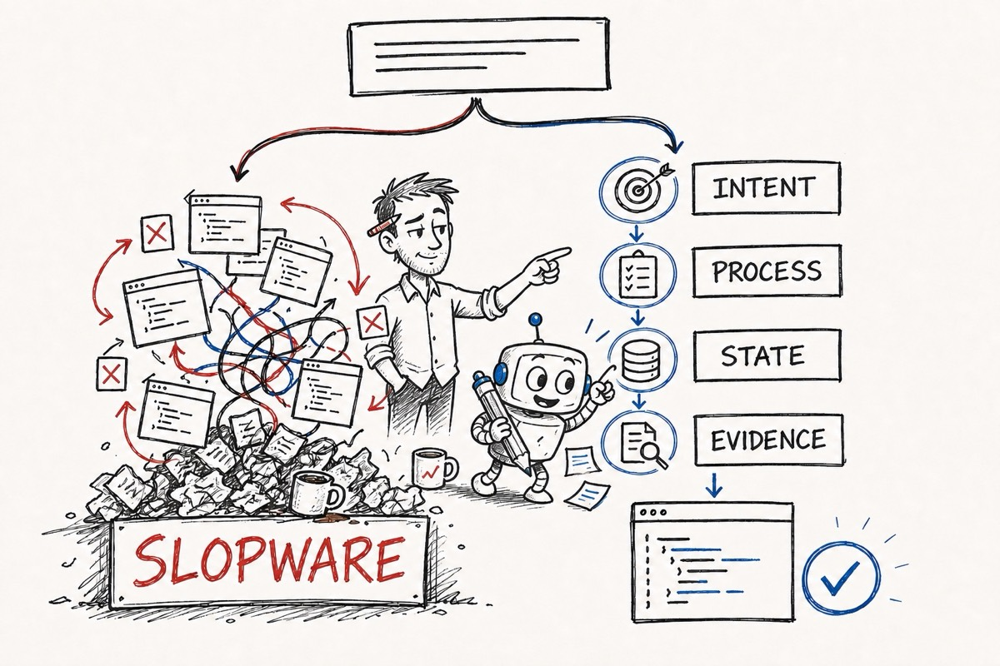
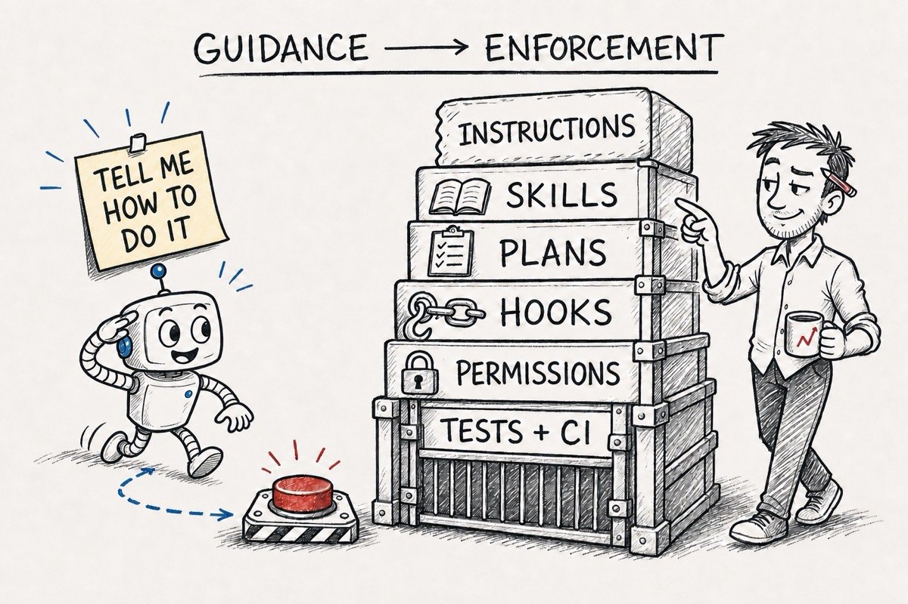
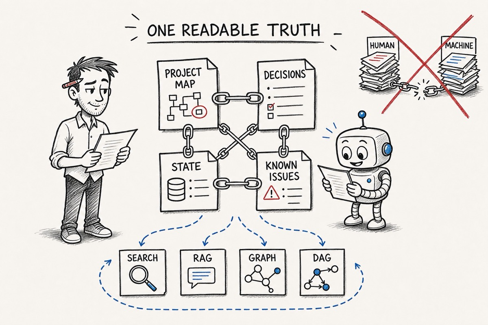

# The Vibengineer Compendium, Part I: Structure or Slopware

**David Tai**, OpenSource.WTF

Coding agents are extremely good at forward progress.

Ask for a feature and you get code. Ask for a fix and you get a patch. Ask whether everything works and, quite often, you get a confident paragraph explaining that it does.

This is why we are all here. It is also how you end up with slopware.

What do I mean by slopware? I do not just mean ugly code. Ugly code can work quite well. I mean plausible code with no stable intention behind it: duplicate implementations of the same piece of code, tests that only agree with the code that was just generated, a plan that got lost three context windows ago, and code that you were told was done that was never actually checked.

The basic problem is that agents can produce code faster than we can preserve intent, inspect consequences, and keep a coherent path forward.

My thesis for this series is simple:

> A coding agent needs a proportionate system process analogous to our standard software engineering processes and best practices. That process preserves intent, validates execution, saves hard-earned lessons, and results in actual progress towards your goals. Without some basic structure, you are mostly asking a very convincing machine to keep its own story straight.

The short version: give your agent some structure or it is going to produce slopware.

## The process separates a shippable, maintainable product from slopware

A useful agent process should give you at least seven things:

- **Consistency:** similar work goes through similar checks.
- **Predictability:** you know what artifact or decision comes next.
- **Resumability:** a new session can recover what is happening and why.
- **Auditability:** important decisions leave something readable behind.
- **Correctability:** there are places to stop, inspect, and redirect.
- **Proportionality:** a typo does not need the same ritual as an authentication rewrite.
- **Evidence:** “done” means something observable happened.

None of these require a huge framework. A short spec, one failing test, a Git branch, and a saved state note may be enough.

The point is not maximum process. The point is the minimum amount of process to control the failure you are worried about.

This lens gives us a better way to look at current agent-process frameworks. Do not ask which one has the most features. Ask what kind of failure it is designed to prevent, and whether you are willing to pay its operating cost.

## Specs, tests, plans, and roles are different controls

Most of the current systems mix a few recurring patterns:

- **Spec-driven development** records what and why before the code.
- **Test-driven development** asks for executable evidence before production code.
- **Plan-driven execution** turns a design into small steps and checks.
- **Role-driven workflows** pass artifacts between product, architecture, development, and QA perspectives.
- **Review-driven workflows** force a pause before work becomes permanent.
- **Investigation loops** require a root-cause theory before a bug fix.

These are not competing religions. They constrain different failure modes.

A spec can stop the agent from solving the wrong problem. It cannot prove the implementation works.

A test can prove a behavior. It cannot prove the behavior was worth building.

A plan can make work resumable. It cannot rescue a bad premise.

A review can catch a bad diff. It becomes expensive if every tiny change needs three agents and a constitutional convention.

The useful systems combine these controls. The annoying systems apply all of them to everything.

## Instructions are not enforcement

This is the most important mechanical distinction in the whole article.

| Mechanism | What it does | What it actually guarantees |
|---|---|---|
| Project instructions | Keeps repository conventions in context | Guidance |
| Skills | Reuses a reasoning or workflow recipe | Guidance unless backed by tools |
| Specs and plans | Preserves intent and task state | A reviewable artifact |
| Hooks | Runs something at a lifecycle event | Automatic invocation |
| Tool permissions | Limits what actions are available | An enforced boundary |
| Tests, linters, and CI | Checks observable properties | A deterministic gate |
| Human checkpoints | Decides whether work should continue | Accountable judgment |

Telling an agent “always run the formatter” is not the same as a hook running it after every edit. Telling an agent “never read secrets” is not the same as a permission system making the file unavailable.

Anthropic makes this distinction directly in its current [Claude Code steering guidance](https://claude.com/blog/steering-claude-code-skills-hooks-rules-subagents-and-more): instructions and skills influence model behavior, while hooks and permissions are the right tools when behavior must happen reliably. Its [hooks documentation](https://code.claude.com/docs/en/hooks-guide) also distinguishes deterministic command, HTTP, and tool hooks from hooks that ask another model to make a judgment.

Codex has a similar separation. Repository instructions live in scoped `AGENTS.md` files, reusable workflow guidance can live in skills, and plugins can package skills together with approved connectors and tools. See the current [Codex `AGENTS.md` documentation](https://learn.chatgpt.com/docs/agent-configuration/agents-md.md) and [skills and plugins overview](https://learn.chatgpt.com/docs/skills-and-plugins.md).

The practical rule is:

> Put preferences in instructions, procedures in skills, durable intent in readable artifacts, and non-negotiable constraints in deterministic gates.

## Which process should you use?

The research for this article looked at the current source and documentation for Superpowers, Superpowers Optimized, BMAD, GitHub Spec Kit, and OpenSpec.

This is not a benchmark result. We have not yet run the same task through every system enough times to make productivity claims. What we can do now is compare their actual workflow mechanics and make conditional recommendations.

For quick reference, here they are from least to most operational complexity:

| Complexity | Approach | Choose it when | You pay for it with |
|---|---|---|---|
| 0 — Minimal | [No full framework](#complexity-no-framework) | The change is small, reversible, and well understood | You must supply the judgment and remember to run the real checks |
| 1 — Light | [OpenSpec](#complexity-openspec) | You want a lightweight, resumable change spec in an existing repository | Human review and external test, CI, and security gates |
| 2 — Moderate | [Superpowers](#complexity-superpowers) | You want portable design, planning, TDD, review, and completion discipline | More checkpoints than small work needs |
| 3 — Moderate–high | [GitHub Spec Kit](#complexity-spec-kit) | You want governed, portable spec-to-implementation artifacts and workflow gates | More artifacts, templates, integration, and governance maintenance |
| 4 — High | [BMAD](#complexity-bmad) | Product, architecture, development, and QA need explicit artifact handoffs | Ongoing stewardship of many roles, documents, and state transitions |
| 5 — Highest here | [Superpowers Optimized](#complexity-superpowers-optimized) | You want proportional routing, deep verification, persistent project state, and Codex hooks | The largest local policy surface, fork maintenance, and lower portability |

This ordering measures setup, artifact volume, workflow gates, and maintenance. It does not measure quality. Spec Kit can be configured into something much heavier, BMAD has lighter routes, and Superpowers Optimized has explicit micro and lightweight paths. Complexity is what you must understand and maintain, not what every individual task necessarily runs.

The table is the TL;DR. The linked sections explain the trade-offs and stopping conditions behind each recommendation.

### Complexity 0 — You want to fix a small thing: use no full framework

You do not need a framework for everything. In fact, I think starting with a framework is probably backwards.

If the change is small, reversible, and you understand it, you probably need:

- A short `AGENTS.md` or equivalent
- A clear task
- A test or some other way to prove it worked
- Git
- A pull request if other people depend on the code

That is still a process. It is just a process small enough to fit the problem.

The downside is that you are the framework. You have to remember when the change stopped being small. You have to notice when the agent wandered off. You have to actually run the checks.

### Complexity 1 — You want lighter brownfield change specs: OpenSpec

[OpenSpec](https://github.com/Fission-AI/OpenSpec) is where I would start if you mostly work in existing code and want a little more structure without turning every change into a project.

The basic flow is explore and propose, apply the change, then archive what changed. It builds small delta specs around the work instead of making you describe the entire system before you are allowed to touch it.

This solves a very normal problem: you discussed the change with an agent, the context got compacted or restarted, and now the reason for the code only exists in your head.

The tradeoff is that OpenSpec mostly gives you readable intent and a workflow. It does not magically become your test suite, security policy, or CI. You still need those.

I would not use it by itself for security-sensitive or high-risk work. Use it with the real gates already in your repository.

### Complexity 2 — You want disciplined engineering by default: Superpowers

[Superpowers](https://github.com/obra/superpowers) is for when you want the agent to follow a recognizable engineering process by default.

It connects design, planning, TDD, implementation, review, verification, and finally what to do with the branch. It also works across a lot of different coding agents, which matters if you do not want your whole process tied to one tool.

The problem it is trying to prevent is the agent hearing an idea, immediately writing code without pausing to assess itself.

You pay for that with checkpoints, which are useful for a real feature. If you or your team will bypass it every time you are in a hurry, do not install the whole thing. A small process you actually follow is better than a sophisticated one you train yourself to ignore.

### Complexity 3 — You want governed, portable specification workflows: GitHub Spec Kit

[GitHub Spec Kit](https://github.github.com/spec-kit/) is for when the spec itself needs to be a real part of the development system.

Its basic chain is easy to understand:

> Spec → Plan → Tasks → Implement

Around that it can add clarification, consistency analysis, convergence, workflow gates, templates, and saved workflow state. It also supports a lot of coding agents.

This makes sense when several people need the intent to survive across tools and sessions, or when an organization wants the same planning artifacts every time.

The cost is obvious: there is more stuff. More templates, more artifacts, more integration, more things that can go stale.

Do not pick it because “spec-driven” sounds responsible. Pick it because somebody will actually review and maintain the specs.

### Complexity 4 — You want explicit product-to-QA handoffs: BMAD

The [BMAD Method](https://github.com/bmad-code-org/BMAD-METHOD) goes further into roles and handoffs. Product requirements become architecture, architecture becomes epics and stories, stories become implementation work, and the work goes through review.

I would look at BMAD when the work is large enough that product, architecture, development, and QA are actually different concerns. It is also useful when multiple agents or sessions need to carry the same intention without each one inventing its own interpretation.

It does have lighter paths. This is important because doing the full PRD-to-QA dance for a five-line change would make everyone hate it.

The real cost is maintaining the artifacts. If nobody owns the PRD, architecture, stories, and implementation state, you have not preserved context. You have built a very organized collection of stale instructions.

Also, roles are not enforcement. A QA agent is not CI. A security review prompt is not a security boundary. You still need the boring real systems underneath it.

### Complexity 5 — You want the same discipline with local routing and memory: Superpowers Optimized

Superpowers Optimized is the system I am using while writing this article. It is our local adaptation of Superpowers and it has opinions.

It adds premise checks, task sizing, fast paths, project maps, saved state, known issues, stronger verification, parallel review, and Codex-specific hooks. The idea is that the process should be strict when the work is dangerous and get out of the way when it is not.

I would use it when work regularly spans sessions, rediscovering the repository is expensive, and false completion claims cost real time.

It is also the most complicated option here. There are more skills, more routing rules, more state, more hooks, and a fork to maintain. It is less portable than upstream Superpowers.

This is obviously not a neutral review. I built my workflow around these ideas because they match the problems I have. We still need to run the same tasks through each system before I claim it produces better results.

## Project memory: keep one readable truth

Agent memory is where people have a tendency to lose their minds.

Index everything. Embed everything. Extract a knowledge graph. Build a DAG. Generate one set of docs for people and another set for the machine.

Now you have two sources of truth.

They will drift.

My recommendation is:

> Keep one linked, human-readable set of project documents. Let humans and agents read the same files. Any RAG index, graph, DAG, embedding store, or generated summary should be a disposable view derived from that source.

Start with boring files:

1. Repository instructions that link to the real files
2. A project map
3. A decision log with examples
4. Current task state
5. Known issues and the fixes that actually worked
6. Normal text search

These are readable by you, your team, and the LLM. They can be reviewed in a pull request. They can link to each other. Git tells you when they changed.

The agents are already designed to grep clusters of human-readable files. Give them good files before you build another memory system.

This is not an anti-RAG or anti-graph position. [ByteRover](https://arxiv.org/abs/2604.01599), for example, is interesting because it uses human-readable Markdown, provenance, and progressive retrieval without requiring a separate vector or graph database.

If your repository gets large enough that normal search stops working, build an index. Just build it *from* the readable source. The index should be something you can delete and regenerate without losing any actual knowledge.

There is also a security problem here. Recent [research on prompt injection through agent memory](https://arxiv.org/abs/2607.14611) found that malicious instructions already planted in memory files can affect current and future sessions. Memory is not harmless documentation. It changes what the agent does later.

Before adding a memory service, ask:

> What can the agent not recover from Git, the current task file, a linked project map, and normal search?

If you do not have a specific answer, you probably do not need RAG. You need better docs.

## The minimum viable setup

If you want somewhere to start, start here:

- One short repository instruction file
- A written task before the agent changes code
- Intended behavior and evidence for anything non-trivial
- Targeted checks while you work
- A short state file before stopping unfinished work
- Linked, human-readable docs for durable decisions
- Git for history
- Hooks only when something really must happen
- Fresh evidence before accepting “done”

You can add a framework later. By then you will know which problem you need it to solve.

## Review: what process are you actually running?

The thesis was that a proportionate system process separates maintainable progress from slopware. It does that by preserving intent, validating execution, saving hard-earned lessons, and producing evidence.

That sounds reasonable in theory. Here is what it means when you apply it to the process you are actually using.

1. **Consistency: similar work goes through similar checks.**
   Does yours? Or does the process change depending on what the agent happens to remember that day?

2. **Predictability: you know what artifact or decision comes next.**
   Do you know what comes next in your process? Can you tell when the agent skipped a step, or do you only discover the process after it happens?

3. **Resumability: a new session can recover what is happening and why.**
   Could a fresh session recover the same intention, constraints, failed attempts, and remaining work? Not merely continue producing code. Resume the actual work.

4. **Auditability: important decisions leave something readable behind.**
   Where do your decisions and hard-earned lessons live? Can people and agents read the same linked source, or does the real explanation only exist in a chat you are afraid to close?

5. **Correctability: there are places to stop, inspect, and redirect.**
   Where are those places in your process? Which controls are instructions the model might follow, and which ones can actually block a bad action?

6. **Proportionality: a typo does not need the same ritual as an authentication rewrite.**
   What failure are you trying to prevent, and is your process sized for that failure? Are you adding ceremony because it helps, or because the framework told you to?

7. **Evidence: “done” means something observable happened.**
   What does done mean in your process? Is there a command, a test, a review, or a deployed version? Or does done mean the agent wrote a convincing summary?

Then ask one final question:

**Will you maintain this process when you are tired and in a hurry?**

A beautiful workflow you bypass under pressure is not your process. The shortcut you take every Friday afternoon is your process.

These were the seven promises at the beginning of the article. If your process does not make the work more consistent, predictable, resumable, auditable, correctable, proportionate, and evidenced, then the process is not doing its job. It is just generating paperwork around the slopware.

The goal is not to make your agent behave like a tiny employee trapped inside a software-development bureaucracy. The goal is to make those seven promises true with the minimum amount of process you will actually maintain.

If your current setup can preserve intent, control the dangerous actions, save the hard-earned lessons, and produce evidence, it is probably enough. Keep it small.

That is the thesis restated after the review: the model gives you forward progress. The process is what makes that progress maintainable.

If your process cannot do these things, adding a smarter model is not going to fix it. It will just produce the same slopware faster and with a better explanation.

And even a very well-behaved agent can still put the same business rule in three different modules.

That is Part II: establish ownership and dominance before the code goes out of control.

## What this comparison does not prove

This comparison is based on current official documentation and direct inspection of the installed Superpowers systems. It compares workflow mechanics, not measured productivity or correctness. We have not run matched feature, bug, refactor, interruption, and documentation-drift experiments across every system, so the recommendations are conditional rather than a winner's podium.
